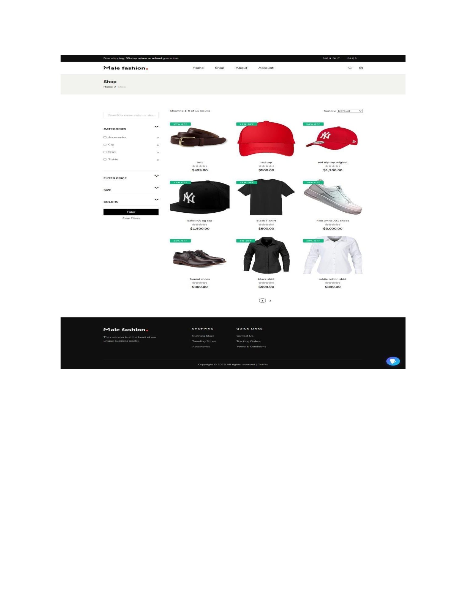
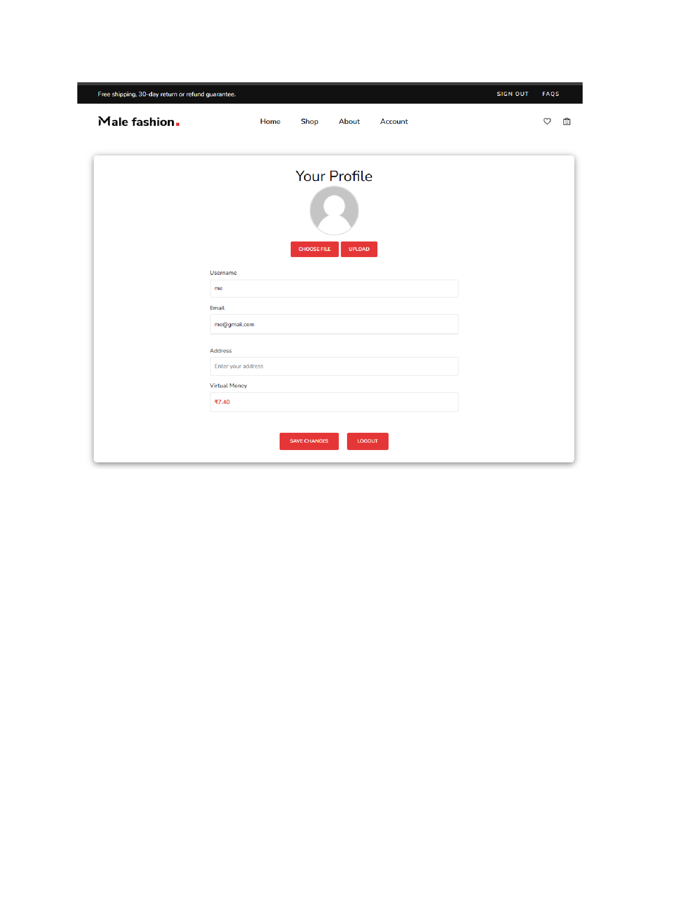

# 🛒 E-commerce Website

This is a demo e-commerce website created by integrating a backend (PHP & MySQL) into a pre-designed front-end template. It was made for learning purposes to understand how backend logic works with front-end designs.

## 🔧 Features

- Product listing page
- Add to cart functionality
- Backend integration using PHP & MySQL
- intermediate admin features for product management

## 📷 Output Screenshots

### Homepage

### Product Detail

### Account Page

> 📌 Note: This project is for demo/learning purposes only.

## 💻 Technologies Used

- HTML, CSS, Bootstrap
- PHP (backend)
- MySQL (database)

## 📁 Setup Instructions

1. Clone the repository.
2. Import `shop.sql` into your MySQL server.
3. Run the project using XAMPP or any PHP-supported server.

## 🔗 GitHub Repository

[github.com/itsParas000/male-fashion](https://github.com/itsParas000/male-fashion)
